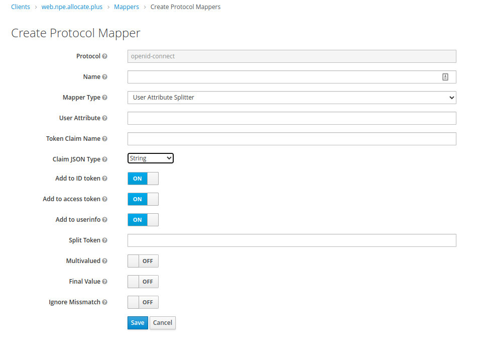

# keycloak-oidc-mapper-user-attribute-splitter
A keycloak oidc protocol mapper based on the user attribute, but with the ability to split on a token or key.

## Compile

`./gradlew compileTestJava`

## Build

`./gradlew build`

## Build

`./gradlew jar`

## Install

Copy the .jar file into the keycloak server's `standalone/deployments` directory.

## Configure

Adding a split token such as `|` will split the value of the user attribute on that token and return the first value unless you `Final Value` is specified.

Note the split token is a java regular expression.  So you could split on `[sS]` if you wanted to split on either `s` or `S` for example.